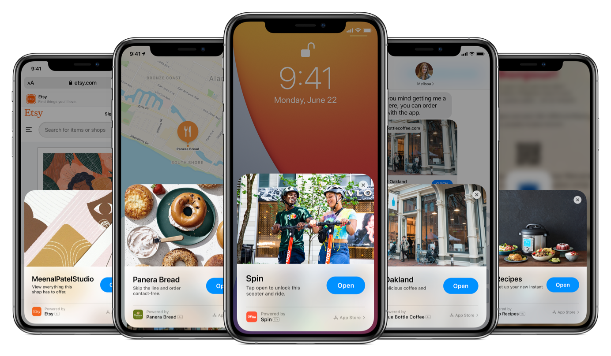

# react-native-ios-app-clips

> Adding iOS 14 App Clips to ReactNative apps.

**This library is under heavy development!**

## Description

You can run project `ReactNativeAppClips` and run `ReactNativeAppClip` seperately, but you can't setup Apple App Clips Experience (Dialogs with CTAs).
We are still waiting on Apple, to test it on TestFlight: https://developer.apple.com/news/releases/?id=07072020h (now App Clips are **unsupported**).

## Installation

[WIP]

## License

Source code is released under the [MIT License](./LICENCE).
